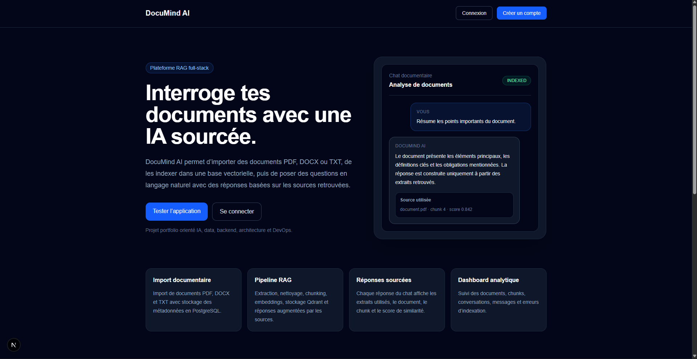

# DocuMind AI

DocuMind AI est une plateforme web RAG permettant d’importer des documents PDF, DOCX et TXT, de les indexer dans une base vectorielle, puis de poser des questions en langage naturel avec des réponses sourcées à partir des documents.

Le projet a été conçu comme un projet portfolio full-stack IA/Data/Backend pour démontrer une chaîne complète : ingestion documentaire, extraction, chunking, embeddings, recherche vectorielle, génération augmentée, citations, authentification, dashboard, Docker et CI/CD.

## Demo

Frontend public :

https://clementdupouypaulin.com/DocuMindAI/

> Note : le frontend est déployé sur GitHub Pages. Certaines fonctionnalités comme l’authentification, l’upload, l’indexation et le chat nécessitent que le backend FastAPI soit lancé localement ou déployé publiquement.

## Features

- Authentification utilisateur avec JWT
- Upload de documents PDF, DOCX et TXT
- Extraction automatique du texte
- Découpage en chunks
- Génération d’embeddings
- Stockage vectoriel dans Qdrant
- Stockage relationnel dans PostgreSQL
- Chat documentaire basé sur RAG
- Réponses sourcées avec document, chunk, score et extrait utilisé
- Filtres RAG par document
- Score minimum de similarité configurable
- Historique des conversations
- Dashboard analytique
- Indexation en arrière-plan
- Gestion propre des erreurs d’indexation
- Interface responsive en Next.js
- Docker Compose
- Tests backend avec Pytest
- CI backend et frontend avec GitHub Actions
- Déploiement frontend GitHub Pages

## Tech Stack

### Frontend

- Next.js
- TypeScript
- Tailwind CSS
- GitHub Pages

### Backend

- FastAPI
- Python
- SQLAlchemy
- Alembic
- Pytest
- Ruff
- Black

### Data / AI

- PostgreSQL
- Qdrant
- OpenAI API
- Embeddings
- RAG pipeline

### DevOps

- Docker
- Docker Compose
- GitHub Actions
- GitHub Pages

## Architecture

DocuMind AI
│
├── apps/
│   ├── web/                  # Frontend Next.js
│   └── api/                  # Backend FastAPI
│
├── docs/                     # Documentation technique
├── storage/                  # Stockage local des uploads
├── .github/workflows/        # CI/CD
├── docker-compose.yml
└── README.md

## Main Screens

### Landing page

Page publique présentant DocuMind AI, son objectif, sa stack et les fonctionnalités principales.

### Dashboard

Dashboard analytique affichant les métriques principales de l’espace utilisateur : documents, chunks, conversations, messages et erreurs d’indexation.

### Documents

Page de gestion documentaire permettant d’uploader, indexer, réindexer, supprimer et suivre le statut des documents PDF, DOCX et TXT.

### Chat RAG

Interface de chat documentaire avec filtres RAG, sélection des documents, score minimum, réponses sourcées et visualisation des extraits utilisés.

